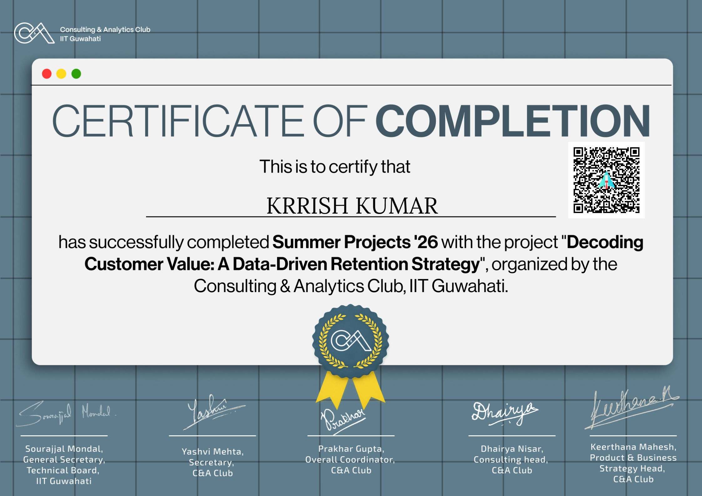

# Decoding Customer Value: A SQL-Driven Retention Strategy 🛍️

*Certified by IIT Guwahati Summer Analytics*

## 📌 The Business Constraint
This project solves the "Cold Start" loyalty problem for a Direct-to-Consumer (D2C) Fashion brand. The primary challenge was synthesizing latent Loyalty, Value, and Promo-Dependency metrics from raw, unlabelled transactional data to generate a definitive Executive Retention Playbook and an actionable Promo Sunset Plan.

## ⚙️ The Technical Architecture & Execution Flow
This project utilizes a two-step, dual-language data architecture:
1. **Python Feature Engine:** Uses Python as a deterministic engine to parse raw logs and synthesize complex, unlabelled behavioral metrics.
2. **SQL Analytics Layer:** Employs structured queries on the engineered data to extract the Ideal Customer Profile (ICP) and drive executive decision-making.

## 🚀 Key Results & Impact
* Successfully bypassed the "Cold Start" problem by engineering deterministic loyalty and churn labels entirely from raw transaction histories.
* Developed a comprehensive "Promo Sunset Plan" to safely reduce promotional discount dependencies without triggering customer churn.

## 💻 Data & Reproducibility (Local Execution)
To reproduce this pipeline locally and view the analysis:
1. Open `D2C_Feature_Engine.ipynb` and execute the Python cells. It will automatically ingest `transactions.csv` and generate the engineered `clean_customer_dimensions.csv` file.
2. Open `Retention_Queries.sql` in any standard SQL environment (or text editor) to view the analytical logic and execute the 5 core business queries against the newly generated dimensional database.

## 📂 Repository Contents
* `D2C_Feature_Engine.ipynb`: Python Pipeline for data ingestion and deterministic feature engineering.
* `Retention_Queries.sql`: SQL Analytics layer answering the core business questions.
* `HackerEarth Hackathon8fc332d.pdf`: The Executive Report detailing the Promo Sunset Plan and Ideal Customer Profile.
* `transactions.csv`: Raw, unlabelled transaction logs.
* `clean_customer_dimensions.csv`: The engineered dimensional database (output generated via Python).
